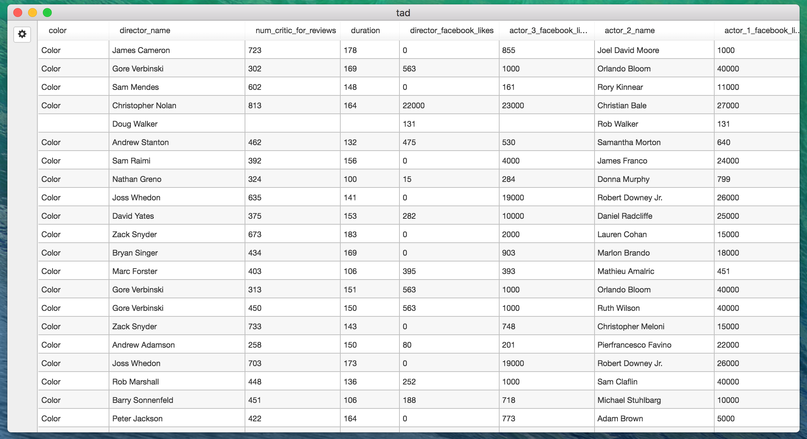

# Tad

Tad is a desktop application for viewing and analyzing tabular data (such as CSV files).

Launching tad from the command line like this:

    $ tad movie_metadata.csv

will open a new window with an interactive grid view of the file contents:

Tad's main grid component is actually a full featured
[pivot table](https://en.wikipedia.org/wiki/Pivot_table); a few additional mouse clicks from the above view yields this:

# Building Tad from Source

## Pre-requisites:  Npm and yarn

To build Tad, you should have [node](https://nodejs.org/en/), `npm` and [yarn](https://yarnpkg.com/) installed locally.  The versions used for development are:

    $ node --version
    v7.1.0
    $ npm --version
    3.10.9
    $ yarn --version
    0.17.10

## Clone the repository

    $ git clone git@github.com:antonycourtney/tad.git
    $ cd tad

## Install Dependencies

# Implementation / Architecture

Tad is an [Electron](http://electron.atom.io/) application written in ES2015 using [flow](https://flowtype.org/) type annotations.
Tad's front end User Interface is implemented in [React](https://facebook.github.io/react/), using [SlickGrid](https://github.com/mleibman/SlickGrid) for the main grid component.
In the main process, Tad uses [SQLite](https://sqlite.org/) for internal storage and efficient queries on tabular data.
